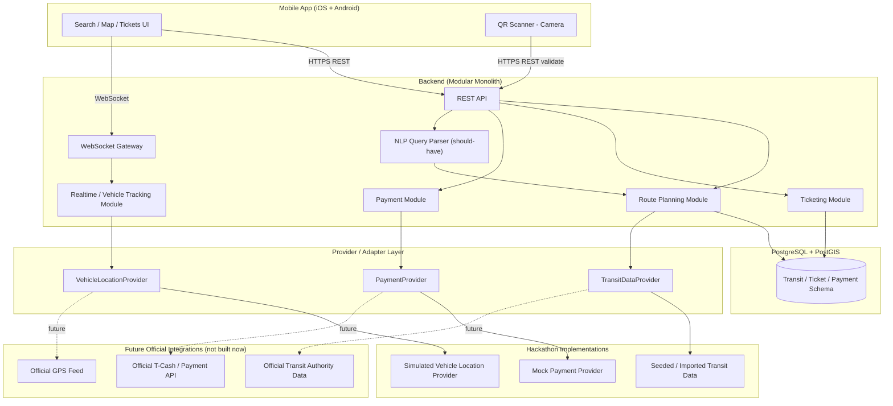
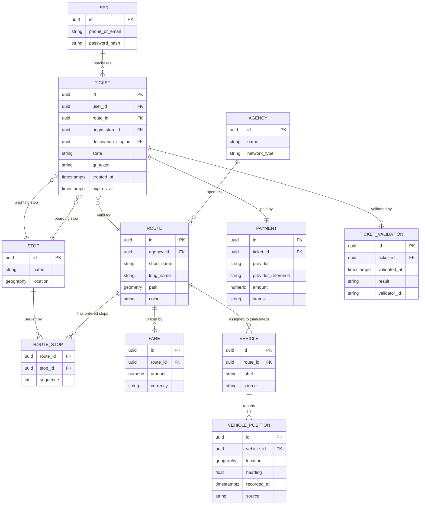
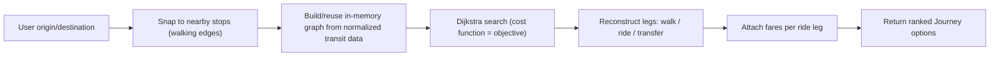
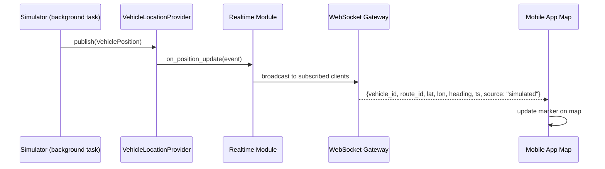
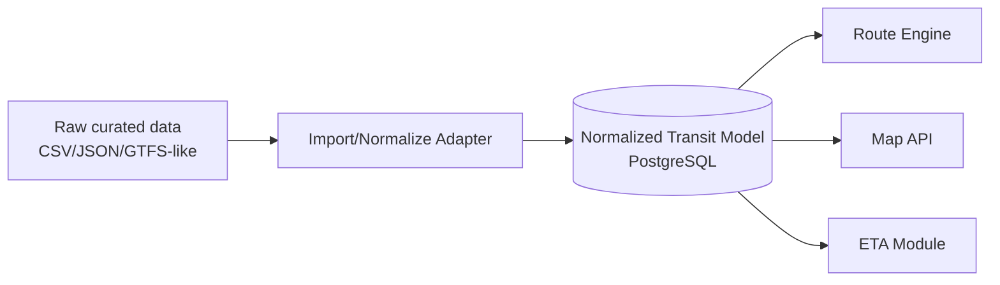
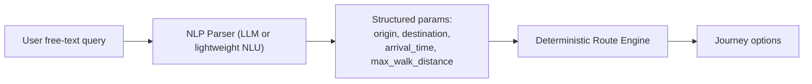
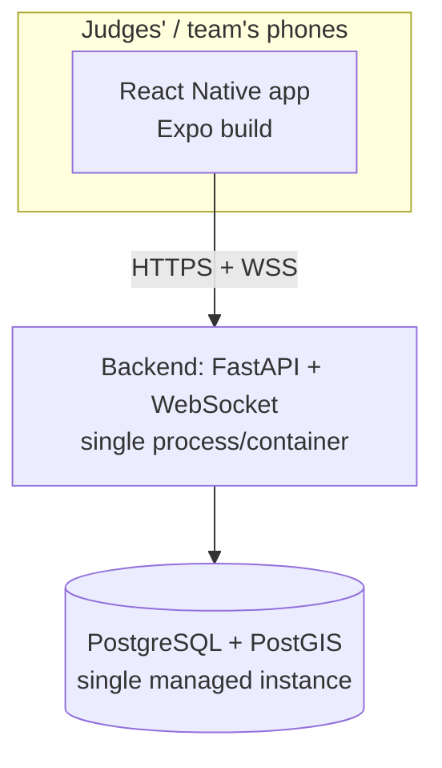
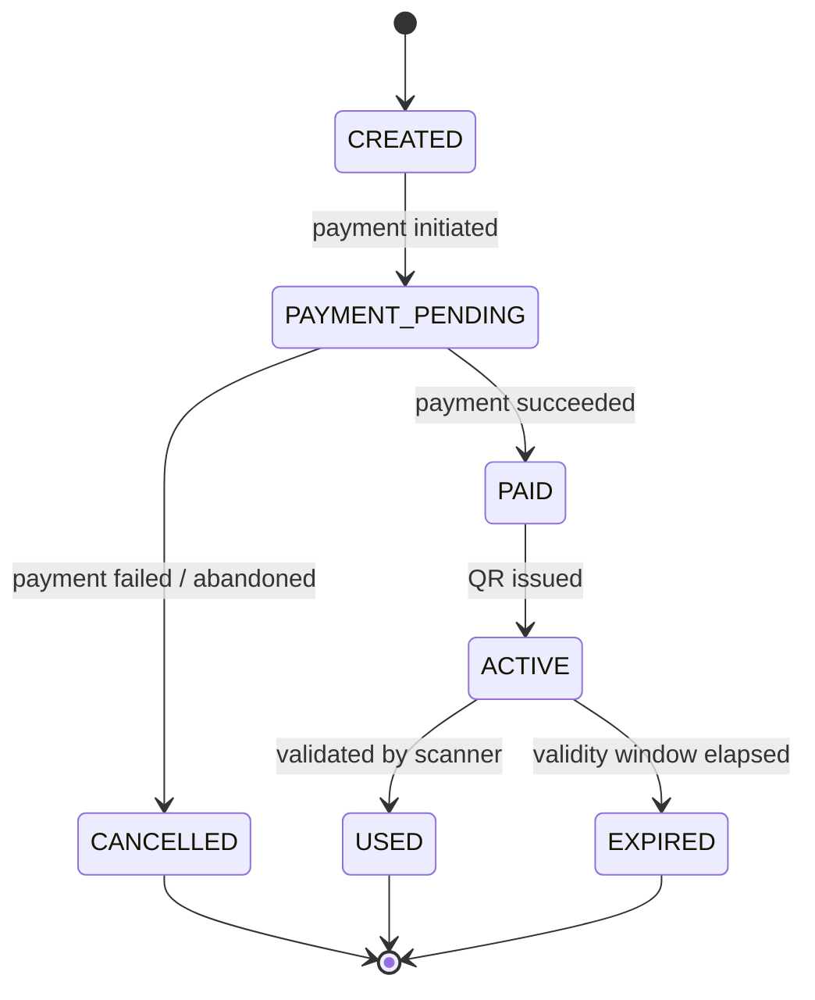

# Architecture

**Project:** Unified Public-Transit Application (Pakistan) by Karwan-e-Khizr — Bano Qabil Hackathon
**Team size:** 4 developers
**Document status:** Pre-hackathon architecture plan

---

## 1. Overview

This document describes the architecture for a public-transit routing and
ticketing application. A user specifies an origin and destination, and the
application computes a multi-leg public-transit journey (walking + one or
more bus/transit legs, including transfers), displays it on a map, shows
live vehicle positions and ETAs, and allows the user to purchase a digital
QR-code ticket before boarding.

The system is being built as a **hackathon prototype**. It uses **simulated
data** for vehicle GPS positions and, where necessary, **mocked/simulated
payments**, because we do not currently have access to official government
GPS feeds, official transit databases, or official payment/T-Cash
credentials. The architecture is deliberately built around **provider
interfaces** so that these simulated components can be swapped for official
integrations later without rewriting the core application.

This document is written for the four developers who will implement the
system. It states what will actually be built during the hackathon, what is
explicitly out of scope, and what assumptions were made.

---

## 2. Goals

- Given an origin and a destination, compute a realistic multi-leg transit
  journey (walk → bus → transfer → bus → walk) using a real, if limited,
  transit dataset.
- Visualize stops, routes, and simulated live vehicles on a map.
- Show ETA for buses at a given stop, computed from simulated positions and
  route/schedule data.
- Allow a user to buy a digital ticket for a chosen journey and receive a
  QR-code ticket that a validator can check.
- Keep every "external system" (vehicle GPS, payment, official transit data)
  behind an interface, so a future partnership can plug in without
  rewriting route planning, ticketing, or the mobile app.
- Keep the system small enough for 4 people to build in a hackathon window.

## 3. Non-Goals

The following are explicitly **not** goals for the hackathon prototype:

- National coverage of all Pakistani transit systems. We will use one city
  (or one well-defined subset of routes) with a manageable, hand-curated
  dataset — see §11 and Assumption A1.
- Real integration with any government GPS feed, official ticketing
  database, or T-Cash production API. No such credentials exist at this
  time, and none will be fabricated or assumed.
- Production-grade scalability, multi-region deployment, or high
  availability. The system targets a demo audience, not live passenger
  load.
- Role-based administration, operator dashboards, or fleet-management
  tooling. These are future-scope only.
- Machine-learning-based ETA/traffic prediction. Not justified for a
  schedule + simulated-position dataset of this size.
- A general-purpose chatbot. If an AI/NLP component is included at all
  (§20), its role is narrowly scoped to parsing a natural-language query
  into structured route-search parameters — never to inventing route,
  fare, or schedule information.

## 4. System Scope

**In scope for the hackathon prototype:**
- One backend service (modular monolith) exposing a REST API and a
  WebSocket endpoint for live vehicle updates.
- One relational database (PostgreSQL + PostGIS) holding transit data,
  tickets, and payments.
- A hand-curated transit dataset for a limited set of routes/stops in one
  city (Assumption A1: Islamabad/Rawalpindi, since that is where the team
  and hackathon are based).
- A vehicle-position **simulator** that generates plausible bus movement
  along real route geometry and feeds it into the backend through the same
  interface a real GPS feed would use.
- A mobile app (iOS + Android, see §16) with map, route search, live
  vehicle tracking, ticket wallet, QR ticket display, and QR scanning.
- A mocked/simulated payment flow, structured behind a `PaymentProvider`
  interface so T-Cash or another real provider can be added later.

**Out of scope (future, partner-dependent):**
- Official GPS ingestion.
- Official transit-authority schedule/fare feeds.
- Official T-Cash or bank payment integration.
- Hardware ticket validators on physical buses.
- Multi-city / national data coverage.

---

## 5. Functional Requirements

1. User enters an origin and destination (text search or map pick) and
   receives one or more suggested journeys.
2. A journey is composed of ordered legs: walking, riding a specific
   route between two stops, transferring.
3. The map shows stops, route lines, the user's location, and simulated
   live vehicles.
4. Clicking a stop shows the routes serving it and each route's ETA.
5. Clicking a route shows its path and stop sequence.
6. User can select a journey/leg and purchase a ticket for a specific fare.
7. Payment (simulated) produces a ticket with a QR code containing a
   signed/opaque token, not raw ticket data.
8. A validator screen can scan a QR code and get a VALID/INVALID result
   from the backend, and mark the ticket used.
9. User can see ticket history and any currently active ticket.
10. (Should-have) User can type a natural-language query
    ("from Saddar to NUST before 9am, minimal walking") and have it parsed
    into structured search parameters that the deterministic route engine
    consumes.

---

## 6. High-Level Architecture



Key idea: the mobile app and the core modules (route planning, ticketing,
real-time gateway) only ever talk to **interfaces**
(`VehicleLocationProvider`, `PaymentProvider`, `TransitDataProvider`). The
hackathon supplies simulated/mock implementations of those interfaces. A
future implementation of the same interface, backed by an official feed,
can be swapped in via configuration — no changes needed in routing,
ticketing, or the mobile app.

---

## 7. Architecture Principles

1. **Provider abstraction only where it pays off.** We introduce an
   interface where we already know today that the implementation will
   change later (vehicle location, payment, transit data ingestion). We do
   **not** introduce interfaces for things that have no realistic second
   implementation (e.g., there is no "AlternatePostgresProvider").
2. **The backend is authoritative.** The mobile app never computes fares,
   validates tickets, or trusts client-supplied ticket data. All of that is
   server-side.
3. **Simulated data is clearly simulated.** Every API response and UI
   element that shows simulated vehicle positions or mocked payments is
   labeled as such (a `source: "simulated"` field in the API, and a visible
   "Demo data" badge in the UI). We do not pretend simulated data is a real
   feed.
4. **Modular monolith, not microservices.** Four developers cannot
   productively operate a distributed system in a hackathon. Modules are
   separated by code boundaries (Python packages/modules with clear
   interfaces), not by network boundaries. See §23 for the full
   justification.
5. **Normalize transit data on import.** Regardless of source format, all
   transit data is converted into one internal schema before anything else
   in the system touches it (§18).
6. **Don't build for scale we don't need.** No Kafka, no Kubernetes, no
   service mesh, no multi-region DB. A single Postgres instance and a
   single backend process are sufficient for a hackathon demo.

---

## 8. Technology Stack

| Layer | Choice | Rationale |
|---|---|---|
| Backend language/framework | **Python + FastAPI** | Async support (needed for WebSocket + simulator), automatic OpenAPI docs (useful for 4 people integrating in parallel), Pydantic validation reduces boilerplate for the many small DTOs (journeys, tickets, vehicle positions) this app needs. Evaluated against Node/Express and Django: Django's batteries (admin, ORM) are less valuable here since we need PostGIS/geo queries and async WebSockets more than an admin panel; Node is a reasonable alternative but the team's stated comfort is Python, and FastAPI's typing/validation reduces integration bugs across a 4-person team working in parallel. **Recommendation: FastAPI.** |
| Database | **PostgreSQL + PostGIS** | Transit data is inherently geographic (stop locations, route geometry, "nearest stop" queries, vehicle positions). PostGIS gives correct, indexed geo queries (`ST_DWithin`, `ST_Distance`) instead of hand-rolled haversine code. Postgres also gives us transactional integrity for ticket/payment state, which a NoSQL store would not simplify here. **Recommendation: confirmed.** |
| Real-time transport | **WebSocket** (single `/ws/vehicles` style channel, see §22/§25) | Vehicle positions need low-latency push to many connected clients; polling REST every few seconds is simpler but wastes bandwidth and adds lag proportional to poll interval. MQTT/Redis pub-sub are unnecessary at this scale — see §15 for the full evaluation. |
| Mobile client | **React Native (Expo)** | Cross-platform (iOS + Android) from one codebase, fastest realistic path for a 4-person hackathon team to get a real installable app with maps, camera-based QR scanning, and push-based live updates. See §16 for full evaluation against Flutter. |
| Map (mobile) | **MapLibre Native, via its React Native bindings, with OpenStreetMap-derived vector tiles** | See §17 for full evaluation. |
| Route planning | **In-process graph search over an internal GTFS-like model** (no external routing engine dependency for the hackathon) | See §13. |
| Task/process model | **Single backend process**, simulator as a background task (asyncio) inside the same process for the hackathon, extractable to a separate process later | Keeps local dev and demo deployment simple; the simulator only needs to write to the same interface the backend consumes, so extracting it later is a deployment change, not a redesign. |

The backend remains a separate, platform-independent REST/WebSocket
service (§10) — it does not embed any mobile-specific logic and would
serve any future client (a second mobile platform, an admin dashboard,
etc.) through the same API.

---

## 9. Mobile Client Architecture

The client is a single **React Native (Expo)** app targeting iOS and
Android from one codebase (§16). Structure by feature, not by technical
layer, so each developer can own a vertical slice, mirroring the module
split used on the backend (§10):

- `features/search` — origin/destination input (including "use my
  current location" via the device location API), journey results list.
- `features/map` — the MapLibre Native map component, stop/route/vehicle
  layers, tap interactions on stops and routes, a "my location" puck
  driven by the device's location permission/API.
- `features/journey` — journey detail screen, leg-by-leg breakdown
  (walk/ride/transfer), fare summary.
- `features/wallet` — ticket wallet: active ticket, QR ticket display
  (rendered from the ticket data returned by the backend, not
  client-generated from raw fields — see §25), ticket history.
- `features/validator` — a separate screen that opens the device camera
  (via a barcode/QR scanning library) to scan a ticket QR, plus a manual
  code-entry fallback, and shows a VALID/INVALID result returned by the
  backend.
- `shared/api` — a thin typed client wrapping the REST API (generated
  from or matched against the OpenAPI schema FastAPI produces, to avoid
  drift between backend and app).
- `shared/realtime` — a WebSocket client with reconnect/backoff and a
  subscription model (§22), exposing vehicle positions to the map layer
  via a simple store (React context or a small state library) so the map
  never talks to the socket directly.
- `shared/auth` — session/token handling, storing the bearer token in the
  platform's secure storage (iOS Keychain / Android Keystore, via Expo
  SecureStore) rather than plain app storage (§25).

**Device capabilities required:** camera (QR scanning), location
(route search "from my location" and the map's "my location" layer), and
network/WebSocket access. Each is requested via the platform's standard
runtime-permission flow, with a clear in-app explanation before the
prompt, and the app degrades gracefully if a permission is denied (e.g.,
manual origin entry if location is denied; manual code entry if camera
access is denied).

The map layer is intentionally decoupled from the realtime client: the map
renders whatever vehicle positions it is given, and does not know whether
they came from the simulator or (later) an official feed. This mirrors the
backend-side provider abstraction and is the concrete requirement from
§6/§29 that "the client should not care whether the source is simulated
or official."

---

## 10. Backend Architecture

Modular monolith, organized as internal modules with narrow interfaces
between them:

```
backend/
  api/              # FastAPI routers (HTTP + WebSocket endpoints)
  routing/          # Route planning engine (graph build + search)
  transit_data/     # TransitDataProvider + normalized transit model access
  realtime/         # Vehicle tracking module, WebSocket broadcast
  vehicle_providers/# VehicleLocationProvider interface + SimulatedVehicleLocationProvider
  ticketing/         # Ticket state machine, QR token issuance/verification
  payments/          # PaymentProvider interface + MockPaymentProvider
  nlp/               # (should-have) natural-language query parser
  db/                # SQLAlchemy models, migrations (Alembic)
  core/              # config, auth, shared utilities
```

Module boundaries matter more than file boundaries: `routing` never imports
from `payments`; `ticketing` calls into `payments` only through the
`PaymentProvider` interface; `realtime` calls into `vehicle_providers` only
through the `VehicleLocationProvider` interface. This is what makes the
"replace the simulator without rewriting the app" requirement (§29)
actually true in code, not just on paper.

**Why not FastAPI's default single-file style:** with 4 people, each module
above maps roughly to one developer's primary area (§27), so keeping the
module boundaries real (not just folders, but explicit interfaces) avoids
merge conflicts and accidental coupling.

---

## 11. Transit Data Model

**Assumption A1:** The hackathon dataset covers a single metropolitan area
(Islamabad/Rawalpindi) with a hand-curated set of routes (e.g., a subset of
Metro/CDA-style corridors) rather than an exhaustive or officially-sourced
dataset. Stop coordinates, route shapes, and schedules for the prototype
are either digitized by the team from public information (published route
maps, on-the-ground knowledge) or approximated for demo purposes, and this
must be clearly labeled in the app as **prototype/community-curated data,
not official data**, exactly as vehicle positions are labeled simulated.

Core entities (normalized, GTFS-inspired but simplified — see §18 for why a
GTFS-like model was chosen):

- **Agency** — a transit operator/network (e.g., "CDA Buses", "Metro").
  Needed because the app is explicitly multi-network.
- **Route** — a named/numbered service (e.g., "FR-03"), belongs to one
  Agency, has a color/label and a geometry (polyline) for map display.
- **Stop** — a physical location (lat/lon as a PostGIS `geography(Point)`),
  may serve multiple routes.
- **RouteStop** — ordered association of a Stop to a Route, with sequence
  number, used both for map rendering and for building the routing graph.
- **Trip** *(minimal for hackathon)* — a scheduled run of a Route,
  optionally with **StopTime** entries (scheduled arrival/departure per
  stop). For the hackathon, schedule data may be simplified to a headway
  (e.g., "every ~10 minutes, 6am–10pm") rather than full per-trip
  timetables, unless real timetable data is readily available — this is
  cheaper to curate and is honest about the data we actually have.
  **Assumption A3.**
- **Vehicle** — a simulated (or, later, real) physical bus, referenced by
  `VehiclePosition`.
- **VehiclePosition** — latest (and optionally historical) lat/lon,
  heading, timestamp, and a `source` field (`"simulated"` for the
  hackathon).
- **Fare** — associated with a Route or Agency; simplified to a flat or
  distance-tier fare per route for the hackathon rather than a full
  fare-matrix system.
- **Journey** — a computed itinerary (not persisted unless a ticket is
  purchased for it); composed of ordered **Legs** (walk or ride).

We deliberately **do not** model `Station` as distinct from `Stop` for the
hackathon (a Station being a cluster of stops/platforms) — Assumption A4 —
since none of the target routes require multi-platform stations to produce
a correct demo. This can be added later without breaking the model (a
Station becomes a parent reference on Stop).

---

## 12. Database Architecture

PostgreSQL + PostGIS, single schema. Simplified ERD (hackathon-scope
entities only; `Trip`/`StopTime` shown as optional/simplified per
Assumption A3):



Notes:
- `VEHICLE_POSITION.source` and `TICKET.qr_token` (an opaque token, not raw
  data — see §19) are the two fields that make the "simulated vs official"
  and "secure QR" requirements concrete at the schema level.
- Indexes: GiST index on `STOP.location` and `VEHICLE_POSITION.location`
  for proximity queries (`ST_DWithin`), plus a B-tree index on
  `VEHICLE_POSITION.recorded_at` per vehicle for "latest position" lookups.
- `Trip`/`StopTime` tables are intentionally omitted from this simplified
  ERD; if full timetables turn out to be available for the chosen routes,
  they slot in as `Trip(route_id, service_calendar)` and
  `StopTime(trip_id, stop_id, sequence, arrival, departure)` without
  changing anything above them.

---

## 13. Route Planning Architecture

**Graph model:**
- **Nodes** = Stops (plus, conceptually, the user's origin/destination
  point, connected to nearby stops by a walking edge computed at query
  time).
- **Edges** = two kinds:
  - *Ride edges*: derived from `RouteStop` sequences — an edge from stop *i*
    to stop *i+1* on a route, weighted by expected travel time (from
    `StopTime` if available, otherwise estimated from route geometry
    length and an assumed average speed — Assumption A5).
  - *Walking edges*: generated at query time between any two stops within a
    configurable walking radius (Assumption A6: 400m default), weighted by
    walking time at an assumed walking speed (~4.5 km/h).
- **Transfers** are simply the graph passing through a walking edge (or a
  same-location transfer with a small fixed penalty) between two ride
  edges on different routes — no special "transfer" entity is needed in
  the graph itself, only a small transfer-time penalty added at the node
  to avoid unrealistic zero-time transfers.
- **Schedules** affect routing by making ride-edge weights time-dependent:
  if `StopTime` data exists, the engine does a time-aware search (depart
  after a given time, prefer the next feasible departure); if only headway
  data exists (Assumption A3), the engine estimates expected wait as half
  the headway.
- **Fares** are attached to the chosen route(s) in the resulting Journey by
  summing the `Fare` for each ride leg (no fare-graph complexity needed for
  a flat/tiered fare model).

**Algorithm:** For the hackathon dataset size (a limited set of stops and
routes in one city, likely low hundreds of stops), a straightforward
**Dijkstra / time-expanded search** over the graph above is sufficient and
easy for the team to reason about and debug. We explicitly avoid
implementing a full RAPTOR/CSA (Connection Scan Algorithm) transit-routing
engine — those exist to scale to city- or country-scale GTFS feeds with
many thousands of trips, which is not our situation. If the dataset grows
substantially post-hackathon, RAPTOR is the natural upgrade path, but it is
not justified now (avoiding the over-engineering the brief warns against).

**Multiple options:** The engine supports different weightings/objectives
by changing the edge-cost function, not by having multiple engines:
- *Fastest*: minimize total time (default).
- *Fewest transfers*: minimize a lexicographic (transfers, then time) cost.
- *Least walking*: minimize total walking distance, time as tiebreaker.
- *Cheapest*: minimize total fare, time as tiebreaker.

For the hackathon MVP, implementing **"fastest"** and **"fewest transfers"**
is the realistic target; "least walking" and "cheapest" are should-have
(cheap to add once the cost function is pluggable, but not required for a
working demo).



The graph itself is rebuilt periodically (or on data change) and cached in
memory — with a hackathon-scale dataset this is fast and avoids querying
Postgres per search for the static parts of the graph. Live vehicle
positions are **not** part of this graph; they only feed ETA (§14/§15),
keeping route planning deterministic and independent of the realtime
system, as the brief requires.

---

## 14. Real-Time Vehicle Tracking

**Interfaces (the core replaceability requirement):**

```
VehicleLocationProvider (interface)
    ├── SimulatedVehicleLocationProvider   (hackathon — built now)
    └── OfficialVehicleLocationProvider    (future — NOT built now, NOT specified;
                                             format unknown until a partnership exists)
```

`VehicleLocationProvider` exposes a minimal, source-agnostic contract:
"give me current positions for vehicles" and/or "push position updates as
they occur." The realtime module (§10) and the mobile app's map (§9) only ever
depend on this contract, never on `SimulatedVehicleLocationProvider`
directly. This is enforced by only ever injecting the provider through
configuration/dependency injection at startup.

**What we are NOT doing:** We are not guessing at the shape of a future
official GPS API. When/if a partnership provides one, an
`OfficialVehicleLocationProvider` adapter is written to translate that
specific API's format into our internal `VehiclePosition` shape — that
adapter is the only new code required; nothing else changes.

**Simulator design (§19 detail):**
- Runs as a background task, one simulated "trip" per active Vehicle.
- Moves each vehicle along its route's stored geometry at a configurable
  speed (with light randomness for realism), publishing a new
  `VehiclePosition` every few seconds through the same
  `VehicleLocationProvider.publish()` call an official feed adapter would
  eventually use.
- Simulates stopping briefly at each stop (dwell time) and simple random
  delay, since "delays" are explicitly listed as something the simulator
  should represent.
- Every emitted position has `source = "simulated"`, which the API and UI
  surface transparently.

---

## 15. Real-Time Architecture (Transport Choice)

**Evaluated options:**
- **Plain REST polling** — simplest to build, but either wastes requests
  (short interval) or feels laggy (long interval); with many clients each
  polling, this also scales worse than a push model for a "many vehicles,
  many viewers" pattern.
- **WebSockets** — a persistent connection lets the backend push position
  updates as they happen; well-supported in FastAPI and in React Native
  (native WebSocket API); matches the "many small, frequent updates"
  shape of this problem well, and behaves sensibly across the
  foreground/background transitions a mobile app goes through (reconnect
  on foreground, see §22).
- **MQTT** — designed for IoT device fleets publishing telemetry; would be
  a reasonable choice if we controlled real bus hardware publishing
  directly, but here the *simulator* is the only publisher and it lives
  inside our own backend, so MQTT would add an extra broker/process for no
  real benefit at this stage.
- **Redis pub/sub** — useful if the backend needed to be horizontally
  scaled across multiple processes/instances so that all instances see all
  vehicle updates. Not justified for a single-process hackathon
  deployment; noted as the natural upgrade if the backend is later scaled
  out.

**Decision:** WebSocket from backend to the mobile app (§25), with vehicle
positions flowing internally from the `VehicleLocationProvider` into an
in-process broadcast to connected WebSocket clients. No external broker
for the hackathon.



---

## 16. Mobile Client Technology Evaluation

The application is a mobile app (iOS + Android). The relevant choice is
between React Native and Flutter — both are realistic for a 4-person
hackathon team; a fully native (separate Swift + Kotlin) build is not,
since it would roughly double UI implementation effort for no benefit at
this stage.

| Option | Assessment |
|---|---|
| **React Native (with Expo)** | Single JavaScript/TypeScript codebase for iOS + Android. Mature libraries exist for everything this app needs: MapLibre Native bindings for the map (§17), camera-based QR/barcode scanning, secure token storage, and standard WebSocket support. Expo significantly lowers hackathon setup/build friction (managed builds, over-the-air preview via Expo Go or a dev client, no need to hand-configure native Xcode/Android Studio projects on day one). If the team's existing JS/TypeScript familiarity (already assumed for the backend's OpenAPI-driven contract and any web tooling) carries over, this minimizes the number of new languages/toolchains the team has to learn during the event. |
| Flutter | Also a strong cross-platform option, with good map-library and camera/QR-scanning support (e.g., `flutter_map` or Mapbox/MapLibre Flutter bindings, `mobile_scanner`), and arguably more consistent UI rendering across platforms out of the box. Its main cost here is Dart: a language/toolchain the team has not indicated prior experience with, which is a real risk during a time-boxed hackathon where debugging speed matters more than long-term UI consistency. If the team already has Dart/Flutter experience, this becomes an equally valid choice — noted explicitly as a close second, not rejected on technical merit. |

**Decision: React Native (Expo)** is recommended primarily on
team-ramp-up risk during a fixed hackathon window, not on a fundamental
technical advantage over Flutter — both frameworks can satisfy every
requirement in §4/§5 (map, live vehicles, route planning UI, ticket
wallet, QR display and scanning). **If the team has stronger existing
Flutter/Dart experience than React/TypeScript experience, Flutter is an
equally valid choice and this decision should be revisited accordingly —
Assumption A2 (below).**

A native mobile app is required for camera access (QR scanning) and a
smooth "my location" map experience; a web app was considered and
rejected for the primary product because it cannot deliver reliable
camera/QR scanning or background-friendly live location across both
platforms without significant extra native-bridge work, and because a
mobile app is what the product brief specifies. A companion web surface
is not part of this architecture (see §30 for the one legitimate
future-facing exception: a possible government/operator web dashboard,
which is unrelated to the passenger-facing app and not built now).

---

## 17. Map Technology Evaluation

| Option | Assessment |
|---|---|
| Google Maps (native SDK) | Requires a billing-enabled API key/project and has usage-based cost; also less natural to layer fully custom real-time vehicle markers and route styling on top of at hackathon speed; licensing terms are also a poor fit for an app whose long-term goal is being an independent transit product. |
| Mapbox (native SDK) | Similar API-key/cost model to Google Maps; free tier exists but still introduces a paid-service dependency for something that has open alternatives. |
| `react-native-maps` (Apple Maps / Google Maps backed) | Very easy to set up, but ties the app to Apple's/Google's map providers and styling, and still runs into the same API-key/cost/licensing issues as above for the Google-backed path on Android. |
| **MapLibre Native, via React Native bindings, + OpenStreetMap-derived vector tiles** | Open-source, no API key required for basic use (self-hosted or free public tile sources), full control over custom layers (stops, routes, vehicles), consistent styling across iOS and Android, and is the same technology family used by many real transit apps. No licensing/cost risk for a hackathon demo. |

**Decision: MapLibre Native** (via its React Native bindings) with
OpenStreetMap-based vector tiles (e.g., a free/public tile source suitable
for a demo, or self-hosted tiles if time allows). This avoids assuming a
paid API is available, per the brief's explicit constraint, and keeps the
map layer's data source (§6/§9) decoupled from any single commercial map
provider.

---

## 18. Data Ingestion

Transit data enters the system through an **importer/adapter layer** that
converts whatever raw format we curate the hackathon dataset in (a
hand-built CSV/JSON export, or a GTFS-like folder if we choose to author
data in that shape) into the normalized model of §11, before anything else
touches it.



**On GTFS specifically:** GTFS (General Transit Feed Specification) is a
well-established normalized format for exactly this kind of data
(agencies, routes, stops, trips, stop_times, fares). We do **not** assume
any Pakistani agency publishes GTFS — none is known to for the routes we
are targeting. However, **authoring our hand-curated hackathon dataset in
a GTFS-like shape** (even if hand-built, not sourced from an agency) is
still a good idea: it is a well-understood schema, tooling exists for it,
and if a future partner *does* provide GTFS or a GTFS-like feed, the
importer only needs a new adapter, not a new internal model. This is the
same "adapter absorbs the format difference, core model stays stable"
pattern used everywhere else in this document. **Recommendation: model our
internal schema as GTFS-inspired (simplified per Assumption A3/A4), fed by
a hand-authored dataset for the hackathon.**

---

## 19. Simulation System

Covered in detail in §14. Summary of what the simulator must do, per the
brief:

- Simulate multiple buses across multiple routes concurrently.
- Move each bus along its route's actual stored geometry (not a straight
  line), at a configurable speed.
- Emit periodic position updates (lat/lon, heading, timestamp).
- Model dwell time at stops and light random delay.
- Publish through the exact same `VehicleLocationProvider` interface a
  real feed would use, tagging every position `source = "simulated"`.
- Be independently runnable/restartable without needing to change the
  backend, route engine, or mobile app.

The simulator is **not** a separate network service for the hackathon (an
in-process background task is simpler and sufficient); it lives in its own
module (`vehicle_providers/simulated.py`) so it can be extracted into a
standalone process later if the team wants to demo "backend running
against a completely separate simulator process" without changing its
internal logic — only how it's launched.

---

## 20. AI / NLP Architecture

**Where AI is justified:** Natural-language journey search
("get from Saddar to NUST before 9am, minimal walking") is a reasonable
should-have feature: it is a genuine parsing/extraction problem (free text
→ structured parameters), and it has a natural, safe boundary.

**Where AI is explicitly not used:** Route computation, fare computation,
schedule/ETA computation, and ticket/payment logic are **never** performed
by an LLM. The brief is explicit about this and it is a hard architectural
rule here: an LLM must not be trusted to invent transit facts.



- The NLP module's **only** output is a structured, validated parameter
  object (origin/destination as resolved stop or place references, an
  optional time constraint, an optional max-walking-distance constraint).
  If it cannot confidently extract origin/destination, it asks the user to
  clarify rather than guessing.
- The route engine treats these exactly like parameters from the normal
  search UI — it has no special "AI mode."
- If time is short during the hackathon, this module is the first thing to
  cut without affecting the rest of the system (should-have, not
  must-have, per §28).
- No chatbot, no conversational assistant, no AI-generated "recommended
  route explanations" are included — the brief explicitly warns against
  features added just to look impressive, and none of those would serve
  the stated goals.

---

## 21. API Architecture

REST for request/response operations; WebSocket for vehicle push (§25).
Representative endpoints (illustrative, not exhaustive — final naming may
shift slightly during implementation):

| Method | Endpoint | Purpose | Auth |
|---|---|---|---|
| GET | `/stops` | List/search stops (by name or bounding box) | No |
| GET | `/stops/{id}` | Stop detail + routes serving it + live ETAs | No |
| GET | `/routes` | List routes | No |
| GET | `/routes/{id}` | Route detail (geometry, stop sequence) | No |
| POST | `/journeys/search` | Compute journey options for origin/destination (+ optional objective, time) | No |
| POST | `/journeys/search/nlp` | (should-have) Natural-language variant of the above | No |
| GET | `/vehicles` | Current vehicle snapshot (fallback if the app's WebSocket connection is down, e.g., briefly after resuming from background) | No |
| GET | `/vehicles/{id}` | Single vehicle detail | No |
| POST | `/auth/register`, `/auth/login` | Create account / obtain session token | No |
| GET | `/tickets` | List current user's tickets | Yes |
| POST | `/tickets` | Create a ticket for a chosen journey/leg (moves to `PAYMENT_PENDING`) | Yes |
| POST | `/payments` | Submit payment for a ticket (mock or, later, real provider) | Yes |
| GET | `/tickets/{id}` | Ticket detail (state, QR reference) | Yes |
| POST | `/tickets/{id}/validate` | Validator submits scanned token; backend returns VALID/INVALID and updates state | Yes (validator role) |

Every response that includes vehicle-derived data (ETA, vehicle position)
includes a `source` field so the app (and any judge inspecting the
API) can see it is simulated. Authenticated endpoints use a bearer token
(§25/§26 — session/JWT, see §25 Security).

---

## 22. WebSocket / Realtime API

- **Endpoint:** `/ws/vehicles` (a single channel for the hackathon; not
  finalized as a hardcoded assumption to build around forever, just the
  concrete choice for now).
- **Connection:** The app connects when the map/live-tracking screen
  becomes active (and reconnects when the app returns to the foreground
  after being backgrounded); the same bearer token used for REST is
  passed for the handshake as a query parameter, kept consistent with the
  REST auth mechanism rather than relying on custom headers on the
  WebSocket upgrade request.
- **App lifecycle:** On backgrounding, the app closes or lets the socket
  drop rather than paying for a live connection it can't render; on
  foreground/resume, it reconnects and immediately re-fetches a snapshot
  via `GET /vehicles` while the WebSocket re-establishes, so the map is
  never left showing stale data silently.
- **Subscription/filtering:** On connect, the client sends a small JSON
  message specifying an area of interest (bounding box) or a set of
  route IDs it cares about, so the server only forwards relevant updates —
  this avoids pushing the entire city's vehicle fleet to every client and
  keeps bandwidth reasonable as the simulated fleet grows.
- **Update format:** `{ "type": "vehicle_position", "vehicle_id", "route_id", "lat", "lon", "heading", "recorded_at", "source": "simulated" }`.
- **Reconnect behavior:** Client uses exponential backoff on disconnect and
  re-sends its subscription on reconnect. The map shows a subtle
  "reconnecting" indicator rather than silently freezing vehicle markers.
- **Stale vehicle handling:** If no update is received for a given vehicle
  within a timeout (e.g., 30s), the app fades/removes its marker rather
  than showing a frozen, misleading position — important since a hung
  simulator task or dropped connection should not make the map lie.

---

## 23. Monolith vs Microservices

**Decision: modular monolith.** With 4 developers and a fixed hackathon
window, microservices would add deployment complexity (multiple services,
service discovery, inter-service auth, a message broker) that provides no
real benefit at this scale — there is no independent scaling need, no
independent team ownership need, and no polyglot requirement here. A
modular monolith with clear internal module boundaries (§10) gets the
maintainability benefit people usually reach for microservices for
(separation of concerns, replaceable components) without the operational
cost. This directly follows the brief's own guidance and is not a
close call for a project of this size.

---

## 24. API Design

(See §21 for the concrete endpoint table; this section covers cross-cutting
API design conventions.)

- JSON request/response bodies throughout; FastAPI + Pydantic gives us
  automatic request validation and an OpenAPI schema the mobile team can
  work against before every endpoint is finished.
- Consistent error shape: `{ "error": { "code": "...", "message": "..." } }`.
- Pagination via `limit`/`offset` on list endpoints (`/stops`, `/routes`,
  `/tickets`) — simple and sufficient at hackathon data volumes.
- Versioning: not introduced for the hackathon (`/v1/...` prefix optional,
  low priority) since there is only ever one deployed version during the
  event; worth adding before any real external partner consumes the API.

---

## 25. Security

Explicitly split into **prototype (hackathon)** and **production
(future)** tiers, per the brief.

### Prototype (hackathon) security — what we will actually build
- **Transport:** HTTPS in any deployed (non-localhost) environment.
- **Auth:** Simple email/phone + password accounts; passwords hashed with
  a standard algorithm (e.g., bcrypt/argon2) — never stored plain.
- **Session strategy:** Short-lived JWT (or signed session token) issued at
  login, sent as a bearer token on REST calls and on the WebSocket
  handshake, and stored on-device in the platform's secure storage (iOS
  Keychain / Android Keystore, via Expo SecureStore) rather than plain
  AsyncStorage. No refresh-token rotation complexity for the hackathon —
  Assumption A7: acceptable given the demo's short lifetime.
- **Input validation:** Enforced automatically by Pydantic models on every
  endpoint (rejects malformed journey/ticket requests by construction).
- **QR ticket security:** The QR encodes an **opaque, unguessable token**
  (e.g., a signed reference or random high-entropy ID), never the raw
  ticket fields (route, fare, user). The validator sends this token to the
  backend, which looks up the authoritative ticket record and returns
  VALID/INVALID — the QR itself carries no trust, only a lookup key/signed
  claim. This directly satisfies the brief's "backend remains
  authoritative" requirement.
- **Replay/duplicate-use prevention:** Ticket state machine (§17 doc — see
  below) — a ticket can be validated only while in `ACTIVE` state; a
  successful validation transitions it to `USED` inside a single database
  transaction (`SELECT ... FOR UPDATE` or an equivalent atomic
  compare-and-set) so two near-simultaneous scans cannot both succeed.
- **Rate limiting:** Basic per-IP/per-user rate limiting on
  authentication and ticket-validation endpoints (the two most
  abuse-sensitive routes) using a simple in-memory or Postgres-backed
  counter — no external rate-limiting infrastructure needed at this scale.
- **Secrets/configuration:** All secrets (DB credentials, JWT signing key)
  via environment variables, never committed to the repo; a `.env.example`
  documents required variables without real values.
- **WebSocket auth:** Same bearer token validated at handshake time (§22).
- **Device permissions:** Camera access (QR scanning) and location access
  are requested through the platform's standard runtime-permission
  prompts, each with a clear explanation of why it's needed; the app
  never silently retries a denied permission and always has a working
  manual fallback (§9).

### Production (future) security — explicitly deferred, not built now
- Real payment/T-Cash PCI-relevant handling, delegated to the official
  provider rather than handled by us directly.
- Refresh-token rotation, device/session management, account recovery
  flows.
- Formal API rate limiting/WAF at the infrastructure layer.
- Audit logging for ticket validation and payment events.
- Role-based access control for operator/admin/government-integration
  roles (§12 users), beyond the single "validator" capability needed for
  the hackathon demo.
- Secrets management via a dedicated secrets store rather than plain
  environment variables.

---

## 26. Deployment

**Local development:**
- `docker-compose` with two services: `postgres` (with PostGIS extension
  enabled) and the FastAPI backend (with the simulator running as a
  background task inside it).
- The mobile app runs via Expo's development client/Expo Go against the
  backend's local network address (or a tunneled URL for testing on a
  physical device), for fast iteration without native rebuilds.

**Hackathon/demo distribution:**

- Mobile app: built as an Expo/EAS preview build (an installable `.apk` for
  Android, and an ad-hoc/TestFlight-style build or Expo Go-loaded bundle
  for iOS) for the duration of the hackathon — this is a demo
  distribution, not an app-store release. No app-store submission is in
  scope for the hackathon.
- Backend: a single container/instance running the FastAPI app, reachable
  over the public internet (HTTPS/WSS) so judges' devices can connect
  without being on the team's local network (the simulator runs inside
  this same process for the hackathon, per §19).
- Database: a single managed PostgreSQL instance with PostGIS enabled.
- **No Redis, no object storage, no CDN, no load balancer** for the
  hackathon — none are justified by the actual traffic/data profile of a
  demo. Redis is called out in §15 as the natural future addition only if
  the backend is horizontally scaled.

This is intentionally the simplest deployment that satisfies the
requirements — one mobile app build, one backend process, one database.

---

## 27. Repository Structure

```
/backend        # FastAPI app: api/, routing/, transit_data/, realtime/,
                 # vehicle_providers/, ticketing/, payments/, nlp/, db/, core/
/mobile         # React Native (Expo) app: features/, shared/
/data           # Hand-curated transit dataset (raw + normalized export),
                 # import scripts
/simulator      # Simulator-specific config/tuning (route speeds, dwell
                 # times) even though the simulator runs inside /backend's
                 # vehicle_providers module — kept separate so non-backend
                 # devs can tune simulation without touching backend code
/docs           # This architecture.md, API notes, data-source notes/assumptions
```

Kept intentionally flat — five top-level directories, matching the five
real areas of concern, rather than a directory per microservice that
doesn't exist.

---

## 28. Team Responsibilities

| Developer | Primary ownership | Key dependencies |
|---|---|---|
| **Dev 1 — Backend / DB / API** | `db/`, `api/`, `transit_data/`, core auth | Needs the data model (§11/§12) agreed early so others can build against it; unblocks everyone else via the OpenAPI schema. |
| **Dev 2 — Mobile App / Map / UI** | `mobile/features/map`, `features/search`, `shared/api` | Needs the OpenAPI schema (from Dev 1) and the WebSocket message format (§22, agreed jointly) early; can build against mocked responses before backend endpoints are finished. |
| **Dev 3 — Routing / Transit Data / Simulator** | `routing/`, `vehicle_providers/`, `/data` curation | Needs the schema (§11) from Dev 1; route engine and simulator can be developed and unit-tested against an in-memory dataset before the real DB integration is wired up. |
| **Dev 4 — Ticketing / Payments / Realtime / Integration** | `ticketing/`, `payments/`, `realtime/`, `nlp/` (if time allows) | Needs the ticket state machine (§29 below) agreed early with Dev 1 (schema) and Dev 2 (UI flow); QR/token format should be settled before UI work on ticket display starts. |

**Avoiding blocking:** the two things that must be agreed on **before**
significant parallel work starts are (a) the normalized data model (§11)
and (b) the WebSocket message + REST response shapes (§21/§22) — both are
covered by FastAPI's auto-generated OpenAPI schema, which should be
treated as the contract between Dev 1/3 (producers) and Dev 2/4
(consumers) from day one, even before every endpoint is fully implemented.

---

## 29. Ticketing Architecture & State Machine

Ticket lifecycle (concrete state machine used by `ticketing/`):



- `CREATED`: user has selected a journey/leg and fare; no payment attempted
  yet.
- `PAYMENT_PENDING`: a `Payment` record exists and is awaiting confirmation
  from the `PaymentProvider` (mock provider for the hackathon — see below).
- `PAID`: payment confirmed; the backend generates the ticket's opaque QR
  token at this point (not earlier — a QR should never exist for an
  unpaid ticket).
- `ACTIVE`: ticket is valid for boarding; this is the state a validator
  scan expects to see.
- `USED`: set atomically on a successful validation (§25 replay
  prevention).
- `EXPIRED`: set once the ticket's validity window passes without use
  (e.g., valid for N hours from purchase — Assumption A8, exact window is
  a product decision, not an architectural one).
- `CANCELLED`: payment never completed.

**Payment provider abstraction:**

```
PaymentProvider (interface)
    ├── MockPaymentProvider     (hackathon — built now: simulates success/
    │                            failure, no real money movement)
    └── TCashProvider / other   (future — NOT built now; no T-Cash API
                                  endpoints or credentials exist yet, and
                                  none are assumed or invented here)
```

`ticketing/` calls `PaymentProvider.charge(...)` and reacts only to a
provider-agnostic result (`succeeded` / `failed` / `pending`) plus a
provider reference string it stores on the `Payment` row — it never
branches on which concrete provider is in use. This is what lets a real
T-Cash integration be added later as a new adapter behind the same
interface, per §29 of the brief.

---

## 30. Future Evolution

What changes when official integrations become available, and — just as
important — **what does not need to change**:

| Capability | What's built now | What changes later | What stays the same |
|---|---|---|---|
| Vehicle GPS | `SimulatedVehicleLocationProvider` | New `OfficialVehicleLocationProvider` adapter translating the partner's real feed format into our `VehiclePosition` shape | `realtime/` module, WebSocket protocol, mobile app map rendering |
| Transit data | Hand-curated dataset + our normalizing importer | New importer adapter for the partner's data format (GTFS or otherwise) | Internal normalized schema (§11), route engine (§13) |
| Payment | `MockPaymentProvider` | New `TCashProvider` (or bank/other) adapter implementing the same interface | `ticketing/` module, ticket state machine, QR issuance logic |
| Ticket validation | Our own `TICKET_VALIDATION` table + validator screen | Possibly synced with an official ticketing system if one becomes authoritative | The QR token contract and the "backend decides VALID/INVALID" principle |
| Fares/schedules | Curated/approximated (Assumption A3) | Real fare/schedule feed via the transit-data importer | Route engine's consumption of `Fare`/`StopTime` — it already expects these fields, just populated more accurately |

The unifying pattern, repeated at every integration point in this
document: **the interface (`VehicleLocationProvider`, `PaymentProvider`,
`TransitDataProvider`) is the contract; only the adapter behind it
changes.** No core module (`routing`, `ticketing`, `realtime`, mobile app)
needs to change when a real integration lands, provided the adapter
correctly maps the partner's data into our existing internal shapes.

**On a possible future web surface:** the passenger-facing product is,
and should remain, the mobile app — no web frontend is introduced by this
architecture. The one plausible future exception, not built now and not
part of the hackathon scope, is an internal **operator/government-partner
web dashboard** (§3 lists this under future roles) for viewing fleet
status, transit data, or ticket-validation activity. If that is ever
built, it would be a separate client consuming the same backend REST API
— it does not change anything described in this document, and is
mentioned here only because it is the one legitimate future-facing reason
a web client might eventually exist alongside the mobile app.

---

## 31. Risks and Constraints

- **Data curation is the real bottleneck.** Route geometry and stop data
  for even one city, hand-curated, takes real time; this should start
  before/alongside coding, not after (Dev 3 + whoever is free).
- **No official data means the demo's realism ceiling is the quality of
  our curated dataset** — the app should be honest about this in its UI
  (visible "prototype/demo data" labeling), both for integrity and because
  judges will likely ask.
- **Time-boxing the NLP feature.** Per §20/§28, this is the first feature
  to cut if time runs short; the core deterministic route search must work
  without it.
- **QR/ticket security is easy to under-scope under time pressure** — the
  opaque-token + backend-authoritative design (§25/§29) is not
  significantly more work than an insecure version and should not be
  skipped, since it's an explicit hard requirement in the brief.
- **WebSocket reconnect edge cases** (stale vehicles, dropped connections)
  are easy to leave until last and are visually obvious if broken during a
  live demo — worth budgeting real time for.

---

## 32. Architectural Decisions (Summary)

| Decision | Chosen | Rejected alternatives | Reason |
|---|---|---|---|
| Backend framework | FastAPI (Python) | Django, Node/Express | Async + WebSocket support, automatic schema for a fast-moving 4-person team |
| Database | PostgreSQL + PostGIS | MongoDB, generic Postgres without PostGIS | Geographic queries are core to the domain |
| Service topology | Modular monolith | Microservices | Team size and hackathon timeline don't justify distributed-systems overhead |
| Realtime transport | WebSocket | REST polling, MQTT, Redis pub/sub | Best fit for push-based, in-process, single-instance demo |
| Mobile client | React Native (Expo) | Flutter, native iOS + Android, web app | Cross-platform from one codebase; lower toolchain-ramp-up risk than Flutter given assumed team background; a web app can't reliably deliver camera-based QR scanning and background-friendly location |
| Map | MapLibre Native via React Native bindings + OpenStreetMap-derived vector tiles | Google Maps, Mapbox | No paid API dependency; full control over custom layers |
| Route search algorithm | Dijkstra over a normalized graph | RAPTOR/CSA | Sufficient and simpler at hackathon data scale |
| Transit data shape | GTFS-inspired internal model | Ad-hoc bespoke schema | Well-understood, future-adapter-friendly, without assuming a real GTFS source exists |
| Vehicle location source | Simulated, behind `VehicleLocationProvider` | Assuming/faking a government feed | No such access exists; brief explicitly forbids inventing one |
| Payment | Mocked, behind `PaymentProvider` | Assuming/faking T-Cash integration | No credentials exist; brief explicitly forbids inventing endpoints |
| QR ticket contents | Opaque/signed token, backend-authoritative | Raw ticket data in QR | Prevents forgery; backend remains source of truth |

---

## Assumptions Log

- **A1:** Hackathon dataset covers a single metro area (Islamabad/
  Rawalpindi), not all of Pakistan.
- **A2:** React Native (over Flutter) is chosen assuming the team's
  stronger existing familiarity is with JavaScript/TypeScript rather than
  Dart; if that's not true for this team, Flutter is an equally valid
  choice per §16 and should be swapped in without changing anything else
  in this document (the backend API contract is framework-agnostic).
- **A3:** Schedule data may be simplified to headways rather than full
  per-trip timetables, unless better data is readily available.
- **A4:** `Station` (multi-platform clustering) is not modeled separately
  from `Stop` for the hackathon.
- **A5:** Ride-edge travel time, where no timetable exists, is estimated
  from route geometry length and an assumed average speed.
- **A6:** Walking-connection radius between stops defaults to 400m.
- **A7:** No refresh-token rotation for the hackathon session strategy.
- **A8:** Ticket validity window is a product decision (e.g., N hours from
  purchase), not fixed architecturally here.

All of the above are explicitly labeled assumptions the team should
confirm or override early, since A1 (dataset scope) and A2 (React Native
vs Flutter) shape the most significant downstream decisions.
